# Monday 2.0 — Technical Architecture Proposal

**Version:** 0.1 (proposal)  
**Status:** Design document — not implemented  
**Supersedes:** Dev-only Vite proxy architecture documented in `CAPACITOR_IOS_MIGRATION.md`

---

## 1. Vision & design principles

Monday 2.0 evolves the current **local-first Vue SPA** into a **multi-surface health memory platform** (web + iOS via Capacitor) with an **optional encrypted cloud layer**.

| Principle | Meaning |
|-----------|---------|
| **Local-first** | IndexedDB (Dexie) remains the source of truth for reads/writes on device |
| **Offline-capable** | Journal, appointments, timeline work without network |
| **Privacy by default** | No account required; cloud is opt-in |
| **E2E encrypted backup** | Server stores ciphertext only; keys derived on device |
| **AI server-side** | LLM keys never ship in client bundles |
| **Incremental migration** | Monday 1.x data imports without breaking changes |

### Deployment modes

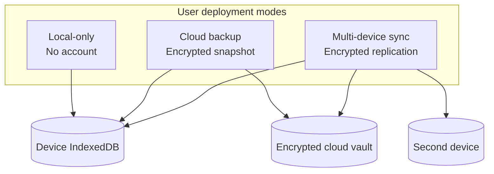

---

## 2. System context

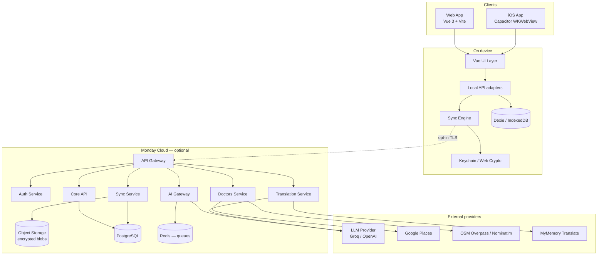

---

## 3. Backend architecture

### 3.1 Service topology

Monday 2.0 backend is a **modular monolith** initially (single deployable `api` service), split into logical modules ready for extraction.

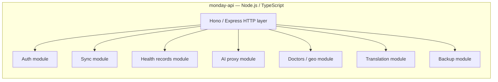

| Service module | Responsibility | Replaces (v1) |
|----------------|----------------|---------------|
| **Auth** | Device registration, JWT/session, recovery codes | None (new) |
| **Sync** | Change feed, conflict metadata, device cursors | None (new) |
| **Health records** | Server-side sync envelopes (ciphertext or structured) | N/A — metadata only in E2E mode |
| **AI proxy** | OpenAI-compatible chat, chunking, rate limits | `vite-llm-proxy-plugin.ts` |
| **Doctors / geo** | Nearby search, reverse geocode | `vite-doctors-nearby-plugin.ts` |
| **Translation** | MyMemory + LLM translation proxy | Vite `/api/translate` proxy |
| **Backup** | Encrypted snapshot upload/download | `vite-db-snapshot-plugin.ts` |

### 3.2 Runtime & infrastructure

| Layer | Technology | Rationale |
|-------|------------|-----------|
| API runtime | Node 22 + TypeScript | Reuse Vite plugin logic |
| HTTP framework | Hono or Fastify | Lightweight, edge-ready |
| Primary DB | PostgreSQL 16 | Relational sync metadata, accounts |
| Object storage | S3-compatible (R2 / S3) | Encrypted backup blobs |
| Queue | Redis + BullMQ | AI job serialization, webhooks |
| Secrets | Environment / KMS | `LLM_API_KEY`, `GOOGLE_PLACES_API_KEY` |
| Observability | OpenTelemetry + structured logs | No PHI in logs |

### 3.3 Deployment targets

| Stage | Target |
|-------|--------|
| Development | Local `monday-api` + Docker Compose (Postgres, Redis, MinIO) |
| Staging | Fly.io / Railway / Render single region |
| Production | API + managed Postgres + object storage; CDN for static web |

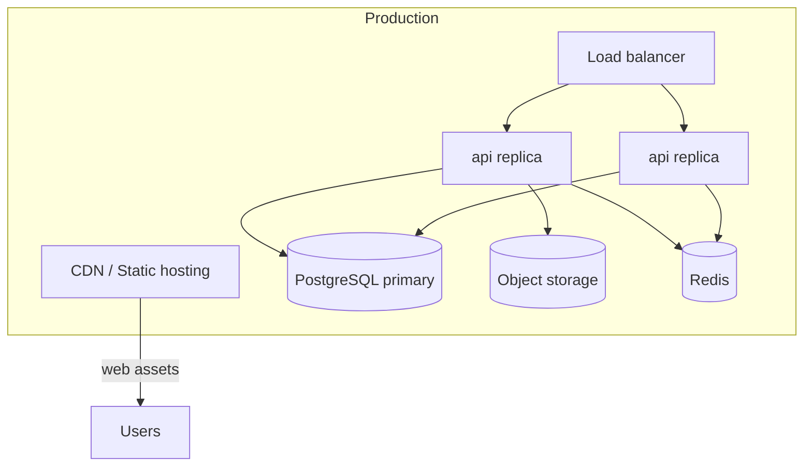

### 3.4 Authentication model

Monday 2.0 introduces **optional accounts** for cloud features only.

| Mode | Auth |
|------|------|
| Local-only | Anonymous device ID in `localStorage` (no server) |
| Cloud backup / sync | Email + magic link or passkey; JWT access + refresh |

**Token shape:**

```json
{
  "sub": "user_uuid",
  "device_id": "device_uuid",
  "scope": ["sync:read", "sync:write", "backup:write", "ai:invoke"],
  "exp": 1735689600
}
```

**Security rules:**
- Refresh tokens rotated on use; stored httpOnly on web, Keychain on iOS
- AI endpoints require `ai:invoke` and server-side feature flag
- Rate limits per `user_id` + `device_id`

---

## 4. API contracts

Base URL: `https://api.monday.health/v1`  
All JSON. Errors follow RFC 7807 `application/problem+json`.

### 4.1 Common types

```typescript
// packages/shared-types/src/api/common.ts

interface ProblemDetails {
  type: string
  title: string
  status: number
  detail?: string
  instance?: string
}

interface Paginated<T> {
  items: T[]
  next_cursor: string | null
}

/** Every syncable entity envelope */
interface SyncRecord<T> {
  id: string                    // UUID v4 — matches Dexie id
  entity_type: EntityType
  rev: number                   // monotonic per entity
  updated_at: string            // ISO 8601
  deleted_at: string | null     // soft delete tombstone
  device_id: string             // last writer device
  payload: T | null             // null when deleted_at set (non-E2E mode)
  payload_ciphertext?: string   // base64 — E2E mode only
  payload_nonce?: string
}

type EntityType =
  | 'health_entry'
  | 'timeline_event'
  | 'hypothesis'
  | 'clinical_model'
  | 'patient_profile'
  | 'appointment'
  | 'hypothesis_assistant_chat'
  | 'user_preferences'
```

### 4.2 Auth

| Method | Path | Description |
|--------|------|-------------|
| `POST` | `/auth/register` | Create account (email) |
| `POST` | `/auth/magic-link` | Send login link |
| `POST` | `/auth/token` | Exchange code for tokens |
| `POST` | `/auth/refresh` | Refresh access token |
| `POST` | `/auth/devices` | Register device for sync |
| `DELETE` | `/auth/devices/{id}` | Revoke device |

**`POST /auth/token` response:**

```json
{
  "access_token": "eyJ...",
  "refresh_token": "eyJ...",
  "expires_in": 3600,
  "user": {
    "id": "usr_01...",
    "email": "user@example.com",
    "e2e_enabled": true
  }
}
```

### 4.3 Sync API

| Method | Path | Description |
|--------|------|-------------|
| `GET` | `/sync/changes?since={cursor}&limit=500` | Pull remote changes |
| `POST` | `/sync/push` | Push local change batch |
| `GET` | `/sync/status` | Cursors, last sync, conflict count |
| `POST` | `/sync/resolve` | Apply conflict resolution decision |

**`POST /sync/push` request:**

```json
{
  "device_id": "dev_01...",
  "client_cursor": "cur_local_abc",
  "changes": [
    {
      "id": "he_01...",
      "entity_type": "health_entry",
      "rev": 3,
      "updated_at": "2026-05-21T10:00:00Z",
      "deleted_at": null,
      "payload_ciphertext": "base64...",
      "payload_nonce": "base64..."
    }
  ]
}
```

**`POST /sync/push` response:**

```json
{
  "accepted": ["he_01..."],
  "rejected": [
    {
      "id": "he_01...",
      "reason": "conflict",
      "server_rev": 4,
      "server_updated_at": "2026-05-21T10:05:00Z"
    }
  ],
  "new_cursor": "cur_server_xyz"
}
```

### 4.4 Backup API (encrypted snapshots)

| Method | Path | Description |
|--------|------|-------------|
| `POST` | `/backups` | Upload encrypted full snapshot |
| `GET` | `/backups` | List backup metadata |
| `GET` | `/backups/{id}` | Download ciphertext blob |
| `DELETE` | `/backups/{id}` | Remove backup |

**`POST /backups` request:**

```json
{
  "format_version": 2,
  "encrypted": true,
  "algorithm": "AES-256-GCM",
  "kdf": "argon2id",
  "device_id": "dev_01...",
  "byte_size": 1048576,
  "checksum_sha256": "abc...",
  "created_at": "2026-05-21T10:00:00Z",
  "ciphertext": "base64..."
}
```

Server stores **metadata in Postgres**, **ciphertext in object storage**. Server cannot decrypt.

### 4.5 AI Gateway

OpenAI-compatible surface for client compatibility with existing `llmClient.ts`.

| Method | Path | Description |
|--------|------|-------------|
| `POST` | `/ai/chat/completions` | Proxy to LLM provider |
| `POST` | `/ai/jobs` | Async long-running AI task |
| `GET` | `/ai/jobs/{id}` | Poll job status / result |
| `GET` | `/ai/status` | Provider availability, model list |

**`POST /ai/chat/completions`** — same shape as OpenAI Chat Completions API.

Additional headers:

```
X-Monday-Feature: journal_analysis | hypothesis | doctor_notes | translation
X-Monday-Device-Id: dev_01...
```

Server enforces:
- Token budget per request (reuse `llmLimits.ts` logic server-side)
- TPM queue (move `llmRequestQueue.ts` to Redis)
- **No persistence** of message content by default (configurable audit-off)

**`POST /ai/jobs` request (async flows):**

```json
{
  "feature": "hypothesis_regeneration",
  "input_ref": "local://hypothesis/hyp_01",
  "messages": [...],
  "model": "llama-3.1-8b-instant"
}
```

### 4.6 Doctors / geo

| Method | Path | Description |
|--------|------|-------------|
| `POST` | `/doctors/nearby` | Search doctors near coordinates |
| `GET` | `/doctors/reverse?lat=&lng=` | Reverse geocode label |
| `GET` | `/doctors/status` | Provider config (Google configured?) |

**`POST /doctors/nearby`** — matches current `NearbyDoctorSearchRequest` / `NearbyDoctorSearchResponse` from `src/models/nearbyDoctor.ts`.

### 4.7 Translation

| Method | Path | Description |
|--------|------|-------------|
| `POST` | `/translate` | Text translation (MyMemory or LLM) |

```json
{
  "text": "боль в колене",
  "source_lang": "ru",
  "target_lang": "en",
  "prefer": "llm"
}
```

### 4.8 User preferences (synced, non-PHI)

| Method | Path | Description |
|--------|------|-------------|
| `GET` | `/preferences` | Theme, locale, AI enabled |
| `PUT` | `/preferences` | Update |

---

## 5. Database schema

### 5.1 Cloud schema (PostgreSQL)

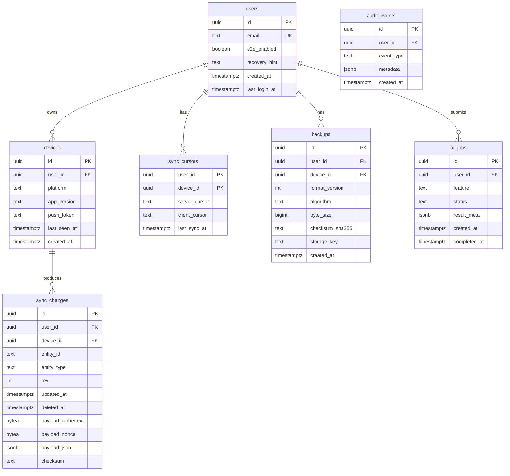

#### DDL (core tables)

```sql
CREATE TABLE users (
  id            UUID PRIMARY KEY DEFAULT gen_random_uuid(),
  email         TEXT NOT NULL UNIQUE,
  e2e_enabled   BOOLEAN NOT NULL DEFAULT TRUE,
  created_at    TIMESTAMPTZ NOT NULL DEFAULT now(),
  last_login_at TIMESTAMPTZ
);

CREATE TABLE devices (
  id          UUID PRIMARY KEY DEFAULT gen_random_uuid(),
  user_id     UUID NOT NULL REFERENCES users(id) ON DELETE CASCADE,
  platform    TEXT NOT NULL,  -- 'web' | 'ios' | 'android'
  app_version TEXT NOT NULL,
  last_seen_at TIMESTAMPTZ,
  created_at  TIMESTAMPTZ NOT NULL DEFAULT now()
);

CREATE TABLE sync_changes (
  id                 UUID PRIMARY KEY DEFAULT gen_random_uuid(),
  user_id            UUID NOT NULL REFERENCES users(id) ON DELETE CASCADE,
  device_id          UUID NOT NULL REFERENCES devices(id),
  entity_id          TEXT NOT NULL,
  entity_type        TEXT NOT NULL,
  rev                INT NOT NULL,
  updated_at         TIMESTAMPTZ NOT NULL,
  deleted_at         TIMESTAMPTZ,
  payload_ciphertext BYTEA,
  payload_nonce      BYTEA,
  payload_json       JSONB,          -- only when e2e_enabled = false (dev/staging)
  checksum           TEXT,
  UNIQUE (user_id, entity_id, rev)
);

CREATE INDEX sync_changes_feed_idx
  ON sync_changes (user_id, updated_at, id);

CREATE TABLE sync_cursors (
  user_id        UUID NOT NULL REFERENCES users(id) ON DELETE CASCADE,
  device_id      UUID NOT NULL REFERENCES devices(id) ON DELETE CASCADE,
  server_cursor  TEXT NOT NULL,
  client_cursor  TEXT,
  last_sync_at   TIMESTAMPTZ,
  PRIMARY KEY (user_id, device_id)
);

CREATE TABLE backups (
  id              UUID PRIMARY KEY DEFAULT gen_random_uuid(),
  user_id         UUID NOT NULL REFERENCES users(id) ON DELETE CASCADE,
  device_id       UUID NOT NULL REFERENCES devices(id),
  format_version  INT NOT NULL,
  algorithm       TEXT NOT NULL,
  byte_size       BIGINT NOT NULL,
  checksum_sha256 TEXT NOT NULL,
  storage_key     TEXT NOT NULL,
  created_at      TIMESTAMPTZ NOT NULL DEFAULT now()
);
```

### 5.2 Local schema (Dexie — device)

Aligns with current `MondayDB` v7. Monday 2.0 adds sync metadata tables locally.

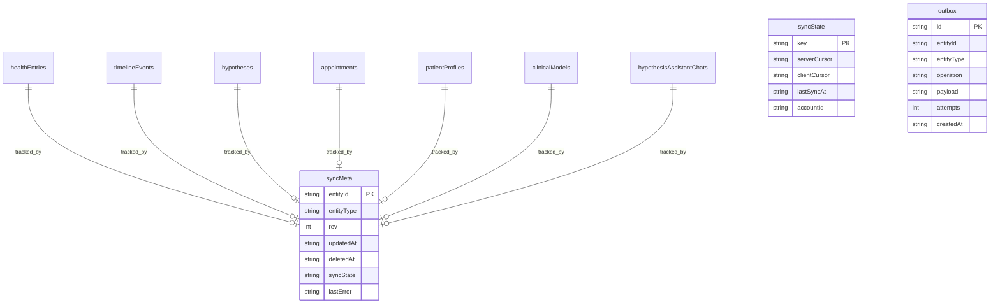

**New Dexie v8 stores:**

```typescript
// Planned addition to MondayDatabase
this.version(8).stores({
  // ... existing tables unchanged ...
  syncMeta: 'entityId, entityType, updatedAt, syncState',
  syncState: 'key',
  outbox: 'id, entityId, createdAt',
})
```

| Local table | Maps to cloud `entity_type` |
|-------------|-------------------------------|
| `healthEntries` | `health_entry` |
| `timelineEvents` | `timeline_event` |
| `hypotheses` | `hypothesis` |
| `clinicalModels` | `clinical_model` |
| `patientProfiles` | `patient_profile` |
| `appointments` | `appointment` |
| `hypothesisAssistantChats` | `hypothesis_assistant_chat` |

**Not synced (ephemeral / derived):**
- Nearby doctor search results
- UI translation cache (`sessionStorage` / `localStorage`)
- LLM traffic logs
- Dashboard computed stats

---

## 6. AI services architecture

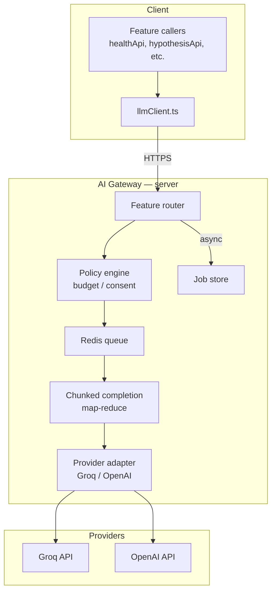

### 6.1 Feature map (migrated from v1)

| Feature | v1 module | Gateway feature key | Sync/async |
|---------|-----------|---------------------|------------|
| Journal analysis | `aiHealthAnalysis.ts` | `journal_analysis` | Sync (<30s) |
| Hypothesis generation | `aiHypotheses.ts` | `hypothesis` | Async job |
| Clinical model | `aiClinicalModel.ts` | `clinical_model` | Async job |
| Doctor notes | `aiDoctorNotes.ts` | `doctor_notes` | Sync |
| Clinical handoff | `aiClinicalHandoff.ts` | `clinical_handoff` | Sync |
| Hypothesis assistant | `aiHypothesisAssistant.ts` | `hypothesis_assistant` | Sync + streaming (v2.1) |
| RU→EN translation | `aiTranslation.ts` | `translation` | Sync |
| UI translation | `uiTranslation.ts` | `ui_translation` | Sync |

### 6.2 Prompt & policy governance

```
packages/ai-prompts/
  journal_analysis.v1.txt
  hypothesis.v2.txt
  doctor_notes.v1.txt
  ...
```

- Prompts versioned server-side; clients send `feature` + `context`, not raw prompt templates
- **Consent gate:** server checks `user_preferences.ai_enabled` and per-feature flags
- **PHI minimization:** server receives only necessary journal excerpts (client-side redaction optional v2.1)
- **Logging:** structured metrics only (tokens, latency, feature); no content retention in prod

### 6.3 Client AI adapter (Monday 2.0)

```typescript
// packages/api-client/src/ai.ts
export function createAiClient(config: { baseUrl: string; getToken: () => string | null }) {
  return {
    chatCompletions(body: ChatCompletionRequest, feature: AiFeature): Promise<ChatCompletionResponse>
    createJob(body: AiJobRequest): Promise<{ job_id: string }>
    getJob(jobId: string): Promise<AiJobStatus>
  }
}
```

Existing `llmClient.ts` becomes a thin wrapper over `api-client` with offline fallback to rule-based engines.

---

## 7. Capacitor mobile architecture

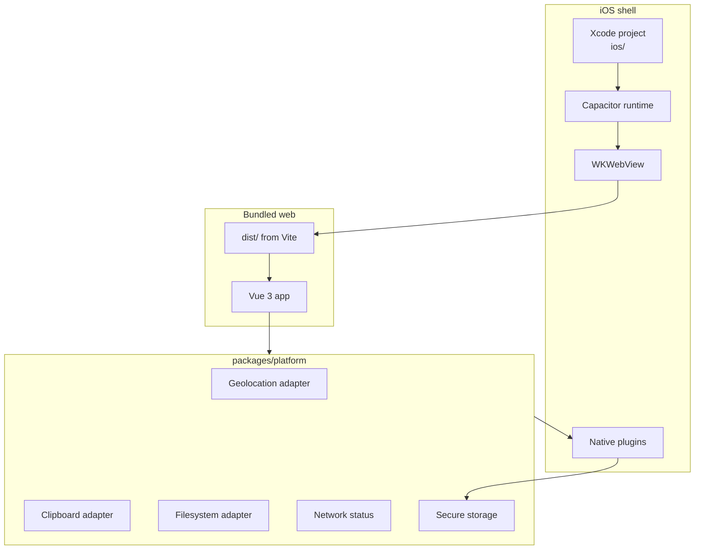

### 7.1 Capacitor plugins

| Plugin | Purpose |
|--------|---------|
| `@capacitor/core` | Platform detection |
| `@capacitor/ios` | iOS shell |
| `@capacitor/app` | Lifecycle, deep links |
| `@capacitor/geolocation` | Doctor search location |
| `@capacitor/clipboard` | Doctor notes copy |
| `@capacitor/filesystem` | Backup export/import |
| `@capacitor/share` | Share notes / backups |
| `@capacitor/network` | Offline banner |
| `@capacitor/preferences` | Non-sensitive prefs |
| `@capacitor/splash-screen` | Launch |
| `@capacitor/status-bar` | Theme integration |
| `@capacitor/keyboard` | Modal keyboard avoidance |
| `@capawesome/capacitor-secure-storage` or custom | Refresh tokens, E2E key handles |

### 7.2 Mobile-specific UI layer

```
apps/web/src/mobile/
  MobileTabBar.vue
  SafeAreaLayout.vue
  FullScreenChat.vue      # hypothesis assistant
  MapListToggle.vue       # nearby doctors
  AppointmentTabs.vue     # replaces 3-column grid
```

**Routing:** `createWebHashHistory()` for iOS v1; migrate to Universal Links in v2.1.

### 7.3 Build pipeline

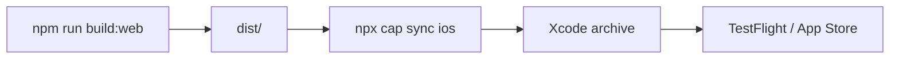

Environment files:

| File | Purpose |
|------|---------|
| `.env.ios.staging` | `VITE_API_BASE_URL`, feature flags |
| `.env.ios.production` | Production API URL |

---

## 8. Data synchronization strategy

### 8.1 Model: outbox + revision feed

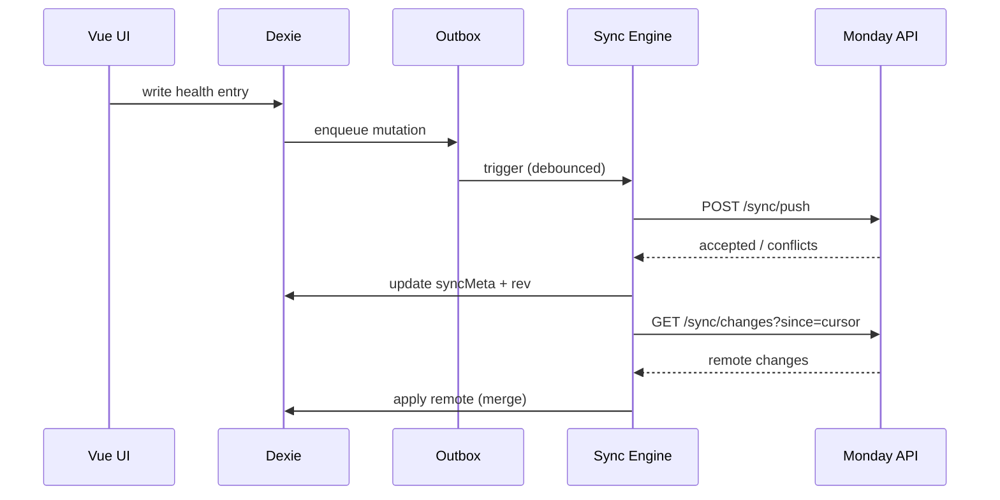

### 8.2 Conflict resolution

| Entity type | Strategy |
|-------------|----------|
| `health_entry` | **Last-write-wins** by `updated_at`; keep conflict copy in `conflicts` local table for user review |
| `hypothesis` | **Merge** history arrays; LWW on title/confidence |
| `appointment` | LWW |
| `patient_profile` | LWW with field-level merge for non-overlapping fields |
| `hypothesis_assistant_chat` | **Append-only** messages; merge by message id |

**Conflict UI:** `SyncConflictPanel.vue` shows side-by-side diff for health entries only (highest risk).

### 8.3 Sync triggers

| Trigger | Action |
|---------|--------|
| App foreground | Pull + push |
| Network restored | Push outbox |
| After local write | Debounced push (2s) |
| Manual | Settings → "Sync now" |
| Periodic | Every 15 min when app active (iOS background limited) |

### 8.4 Cursor protocol

```
server_cursor = base64(user_id:last_change_id)
client_cursor = base64(device_id:last_applied_change_id)
```

Idempotent push: same `(entity_id, rev)` rejected if `rev <= server.rev`.

---

## 9. Local-first + cloud backup strategy

### 9.1 Tiered data plan

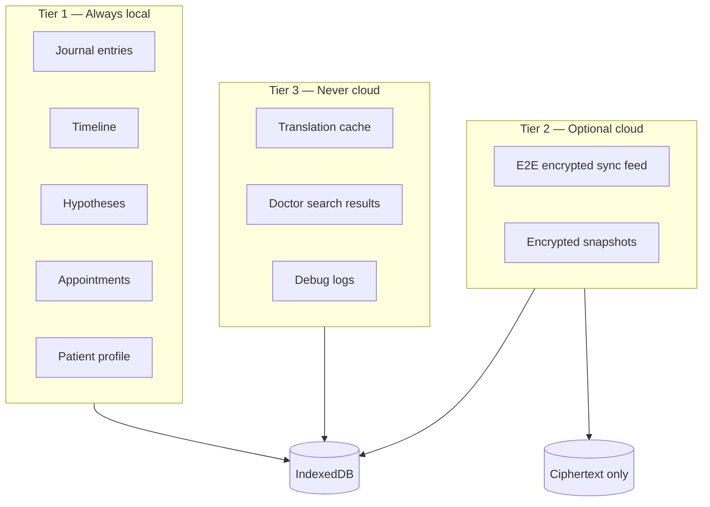

### 9.2 Encryption design (E2E)

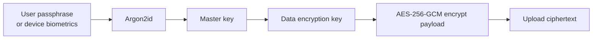

| Element | Detail |
|---------|--------|
| Key derivation | Argon2id from user passphrase + per-user salt (stored server-side) |
| Per-record nonce | Random 12-byte nonce per `sync_change` |
| Device key | Secure Enclave / Keychain wraps master key on iOS |
| Recovery | Optional 24-word recovery key (shown once); server stores hash only |
| Server visibility | Metadata only: `entity_type`, `updated_at`, `byte_size`, `checksum` |

### 9.3 Backup modes

| Mode | Description | Use case |
|------|-------------|----------|
| **Manual export** | JSON file via Share sheet | User-owned backup |
| **Scheduled cloud backup** | Nightly encrypted snapshot if charging + Wi-Fi | Disaster recovery |
| **Continuous sync** | Outbox feed | Multi-device |

**Snapshot format v2:**

```json
{
  "format_version": 2,
  "exported_at": "2026-05-21T10:00:00Z",
  "device_id": "dev_01...",
  "encrypted": true,
  "algorithm": "AES-256-GCM",
  "tables": {
    "healthEntries": "ciphertext...",
    "timelineEvents": "ciphertext..."
  }
}
```

### 9.4 Offline behavior matrix

| Action | Offline | Online |
|--------|---------|--------|
| Create journal entry | ✅ local | ✅ local + queue sync |
| AI analysis | ❌ rule-based fallback | ✅ via AI gateway |
| Nearby doctors | ❌ | ✅ |
| Restore backup | ✅ from local file | ✅ from cloud |
| Login / register | ❌ | ✅ |

---

## 10. Repository structure (monorepo)

```
monday/
├── apps/
│   ├── web/                          # Vue 3 SPA (current src/ migrated here)
│   │   ├── src/
│   │   │   ├── views/
│   │   │   ├── components/
│   │   │   ├── composables/
│   │   │   ├── mobile/               # Mobile-specific UI
│   │   │   └── main.ts
│   │   ├── index.html
│   │   ├── vite.config.ts
│   │   └── capacitor.config.ts
│   └── ios/                          # Generated: npx cap add ios
│       └── App/
│
├── packages/
│   ├── shared-types/                 # Entity + API types (single source of truth)
│   │   ├── src/
│   │   │   ├── entities/             # HealthEntry, Hypothesis, ...
│   │   │   ├── api/                  # Request/response contracts
│   │   │   └── sync/
│   │   └── package.json
│   ├── api-client/                   # Typed fetch client for Monday API
│   │   ├── src/
│   │   │   ├── auth.ts
│   │   │   ├── sync.ts
│   │   │   ├── ai.ts
│   │   │   ├── doctors.ts
│   │   │   └── backups.ts
│   │   └── package.json
│   ├── sync-engine/                  # Outbox, pull, merge, conflict
│   │   ├── src/
│   │   │   ├── outbox.ts
│   │   │   ├── pull.ts
│   │   │   ├── push.ts
│   │   │   ├── merge/
│   │   │   └── crypto.ts
│   │   └── package.json
│   ├── platform/                     # Capacitor vs web adapters
│   │   ├── src/
│   │   │   ├── geolocation.ts
│   │   │   ├── clipboard.ts
│   │   │   ├── storage.ts
│   │   │   └── network.ts
│   │   └── package.json
│   ├── ai-prompts/                   # Versioned server prompt templates
│   └── db-local/                     # Dexie schema + migrations
│       ├── src/
│       │   ├── database.ts
│       │   └── migrations/
│       └── package.json
│
├── services/
│   └── api/                          # Monday backend (monolith v1)
│       ├── src/
│       │   ├── index.ts
│       │   ├── modules/
│       │   │   ├── auth/
│       │   │   ├── sync/
│       │   │   ├── ai/               # Port from scripts/vite-llm-proxy-plugin.ts
│       │   │   ├── doctors/          # Port from scripts/vite-doctors-nearby-plugin.ts
│       │   │   ├── translate/
│       │   │   └── backups/
│       │   ├── db/
│       │   │   ├── schema.sql
│       │   │   └── migrations/
│       │   └── middleware/
│       ├── Dockerfile
│       └── package.json
│
├── infra/
│   ├── docker-compose.yml            # Postgres, Redis, MinIO for dev
│   ├── terraform/                    # Optional IaC
│   └── k8s/                          # Future
│
├── docs/
│   ├── MONDAY_2_ARCHITECTURE.md      # This document
│   ├── CAPACITOR_IOS_MIGRATION.md
│   ├── AI_INSIGHTS.md
│   └── api/
│       └── openapi.yaml              # Generated from shared-types
│
├── scripts/
│   ├── migrate-v1-to-v2.mjs          # Import legacy MondayDB export
│   └── dev.mjs                       # Start web + api + docker compose
│
├── package.json                      # npm workspaces root
├── pnpm-workspace.yaml
└── turbo.json                        # Optional build orchestration
```

### 10.1 Package dependency graph

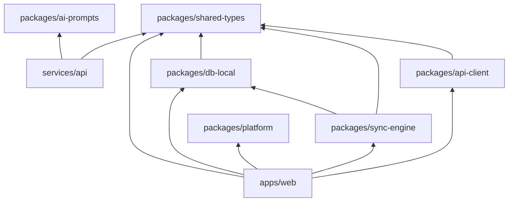

### 10.2 Migration path from current repo

| Current path | Monday 2.0 destination |
|--------------|----------------------|
| `src/` | `apps/web/src/` |
| `src/db/` | `packages/db-local/src/` |
| `src/models/types.ts` | `packages/shared-types/src/entities/` |
| `scripts/vite-llm-proxy-plugin.ts` | `services/api/src/modules/ai/` |
| `scripts/vite-doctors-nearby-plugin.ts` | `services/api/src/modules/doctors/` |
| `scripts/doctors-nearby-shared.ts` | `packages/shared-types` + `services/api` |
| `vite.config.ts` dev proxies | `services/api` + `api-client` base URL |

---

## 11. Implementation phases

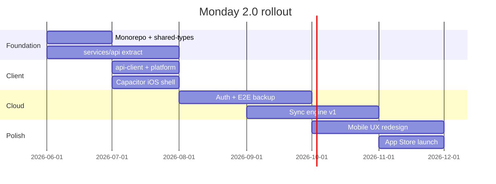

| Phase | Deliverable |
|-------|-------------|
| **2.0-alpha** | Monorepo, `services/api`, web + iOS pointing at staging API |
| **2.0-beta** | E2E encrypted backup, auth, local-only mode preserved |
| **2.0-rc** | Multi-device sync, conflict UI |
| **2.0** | App Store + production API |

---

## 12. Risks & mitigations

| Risk | Impact | Mitigation |
|------|--------|------------|
| E2E key loss = data loss | Critical | Recovery key + export reminders |
| Sync conflicts confuse users | High | Limit conflict UI to journal; sensible defaults |
| LLM cost at scale | High | Per-user quotas, async jobs, caching |
| iOS background sync limits | Medium | Push on foreground; manual sync |
| Regulatory perception | Medium | Clear disclaimers; no diagnostic claims |
| Monorepo migration cost | Medium | Incremental; keep v1 shippable on `main` |

---

## 13. Open decisions

1. **Monorepo tool:** npm workspaces vs pnpm + Turborepo
2. **Auth provider:** Custom magic link vs Clerk / Supabase Auth
3. **E2E default:** On by default for cloud users vs optional
4. **Sync default:** Backup-only v2.0 vs full sync at launch
5. **Streaming AI:** SSE for hypothesis assistant in v2.0 or v2.1
6. **Android:** Same Capacitor shell in v2.0 or iOS-first

---

## 14. References

- Current local schema: `src/db/database.ts`, `src/models/types.ts`
- Current LLM client: `src/services/llm/llmClient.ts`
- Current doctor search: `src/models/nearbyDoctor.ts`, `scripts/vite-doctors-nearby-plugin.ts`
- Capacitor migration plan: `CAPACITOR_IOS_MIGRATION.md`
- AI feature overview: `docs/AI_INSIGHTS.md`
