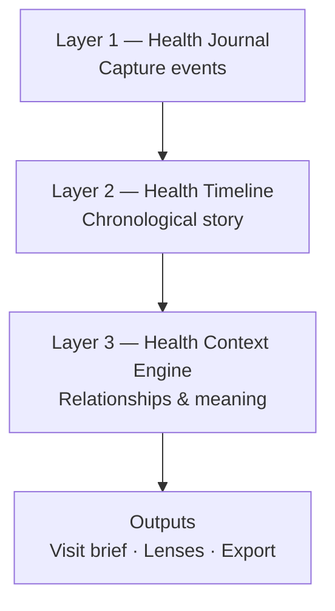
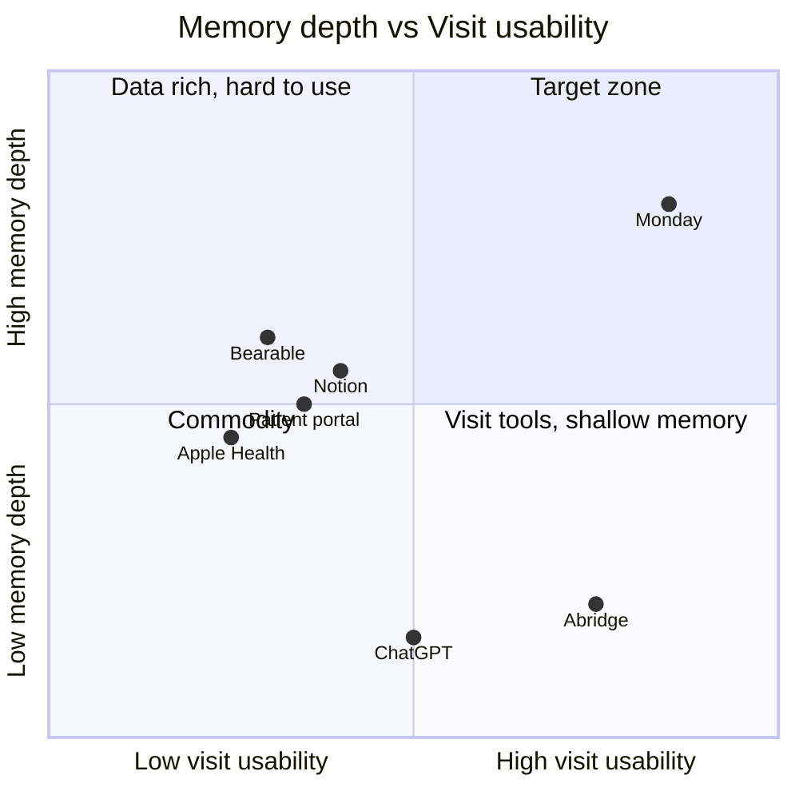
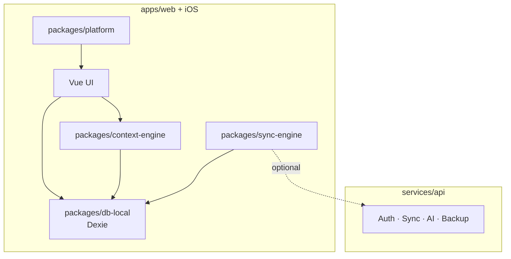
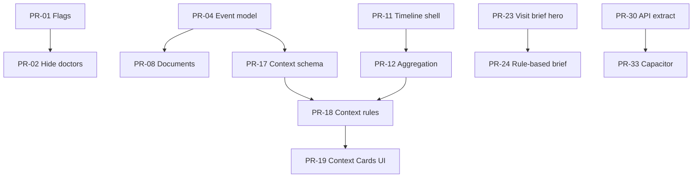

# Personal Health Memory System — Product & Technical Roadmap

**Monday product evolution**  
**Version:** 1.0  
**Date:** May 2026  
**Audience:** Founders, product, engineering, investors  
**Status:** Strategic planning document

**Related artifacts:**

- [ADR-0001: Product optimization priority](../adr/0001-product-optimization-priority.md) — **Personal Health Memory-first** (Accepted)
- [MONDAY_STARTUP_ANALYSIS.md](../../MONDAY_STARTUP_ANALYSIS.md)
- [MONDAY_2_ARCHITECTURE.md](../../MONDAY_2_ARCHITECTURE.md)
- [CAPACITOR_IOS_MIGRATION.md](../../CAPACITOR_IOS_MIGRATION.md)

---

## 1. Vision

### Category

**Personal Health Memory System (PHMS)**

A product category where the primary job is to **remember, structure, and make usable** a person's health story across months and years — owned by the patient, not the clinic.

### Vision statement

> **Monday remembers your health story better than anyone else.**

Monday is not primarily an AI assistant, symptom checker, doctor search tool, telemedicine service, or EHR replacement. It is the **system of record for how the patient experienced their health journey** — and the engine that turns that memory into clarity at the moments that matter (especially before and after clinical encounters).

### Strategic north star (ADR-0001)

Optimize **Personal Health Memory-first**. Journal is how memory enters. Timeline is how memory is organized. **Context Engine** is how memory becomes useful. AI accelerates extraction and briefs — it does not define the category.

### Three product layers

| Layer | Purpose | User question answered |
|-------|---------|------------------------|
| **1. Health Journal** | Capture symptoms, diagnoses, meds, tests, visits, procedures, documents, notes | "What happened?" |
| **2. Health Timeline** | Structured chronological views (diagnosis, medication, treatment, symptom arcs) | "When did it happen, in what order?" |
| **3. Health Context Engine** | Surface relationships: treatment→outcome, med→side effect, procedure→recovery | "What changed because of what?" |

---

## 2. Product strategy

### 2.1 Unique value proposition

**UVP:** The only patient-owned system that preserves your full health story — structured over time — and helps you **use** it when speaking to clinicians.

**One-liner for market:** *Remember your health story. Walk into every visit prepared.*

### 2.2 Primary persona

**Chronic / complex health journey patient** — multiple body areas, multiple clinicians, multi-year narrative. Self-advocates. Frustrated by portals and scattered notes.

**Secondary:** Specialist referral prep (need coherent story fast).

**Not primary:** Acute emergency, wellness-only trackers, clinician users (B2B comes later).

### 2.3 Wedge → expand

1. **Wedge:** One-tap **visit brief** before appointments (specialty-aware)  
2. **Habit:** Low-friction journal → automatic timeline  
3. **Moat:** Context relationships compound over years  
4. **Platform:** Encrypted backup, multi-device, iOS, optional clinician share  

### 2.4 What we will not build (explicit non-goals)

- Diagnosis or triage chatbot  
- Telemedicine / prescribing  
- Doctor marketplace / search as core  
- EHR replacement or provider workflow  
- Passive-only wearable dashboard (Apple Health already wins)  

### 2.5 Business model (seed-stage hypothesis)

| Stream | Model |
|--------|--------|
| **Free** | Journal + timeline + rule-based brief |
| **Pro** | AI-enhanced briefs, context insights, encrypted cloud backup |
| **Future B2B2C** | Clinic white-label prep layer, employer chronic-care navigation |

---

## 3. Product layers (current state vs target)

### Layer 1 — Health Journal

| Capability | Today (`src/`) | Target |
|------------|----------------|--------|
| Symptom / visit / med logging | `HealthEntryForm.vue`, `entryTypeFormConfig.ts` | + documents, procedures as first-class types |
| Entry classification | `healthAnalysis.ts` | Stable taxonomy + user override |
| Bulk history import | `AnamnesisModal.vue`, `anamnesisParser.ts` | Improved parsing + review UI |
| Linked appointments | `journalAppointmentSync.ts` | Post-visit capture prompts |
| Documents / PDFs | ❌ | Attachments with metadata (not OCR-first) |

### Layer 2 — Health Timeline

| Capability | Today | Target |
|------------|-------|--------|
| Auto timeline from journal | `healthApi.ts` → `timelineEvents` | Keep; strengthen sync |
| Timeline UI | `Timeline.vue` (unrouted), dashboard refs | **Dedicated timeline lenses** |
| Medication timeline | Implicit in entries | **Filtered lens** |
| Symptom progression | `SeverityLineChart.vue` | Lens + context-linked |
| Diagnosis / treatment arcs | Partial via entry types | Explicit lens filters |

### Layer 3 — Health Context Engine

| Capability | Today | Target |
|------------|-------|--------|
| Pattern hypotheses | `hypothesisGenerator.ts`, `HypothesisCard.vue` | Evolve → **Context Cards** with evidence |
| Clinical model | `clinicalModelGenerator.ts` | Body-area memory summary |
| Medical history context | `medicalHistoryContext.ts` | Foundation for relationship extraction |
| Treatment → outcome | Rule-based hints only | **Explicit relationship model** |
| User-visible insights | "Hypotheses" (clinical tone) | Plain-language context: *"Pain improved after orthotics"* |

### Output layer (memory → action)

| Output | Today | Target |
|--------|-------|--------|
| Visit brief | `DoctorNotesPanel.vue`, `clinicalDoctorNotes.ts` | **Hero feature** — specialty templates |
| Post-visit memory | ❌ | Structured "what doctor said" entry |
| Export / print | Print + clipboard | PDF, Share sheet, iOS |
| Share with clinician | ❌ | Time-limited link or QR (encrypted, v3) |

---

## 4. Competitive positioning

### 4.1 Positioning map

### 4.2 Differentiators

| Competitor | Their center of gravity | Monday difference |
|------------|-------------------------|---------------------|
| **Apple Health** | Passive sensors, activity rings | Narrative memory + visit brief; patient-authored |
| **Google Health Connect** | Device data pipes | Story + context across years; not metric-first |
| **Notion / notes** | Unstructured flexibility | Medical structure: urgency, body area, timeline, brief |
| **ChatGPT** | Stateless Q&A | Persistent structured memory; evidence-linked outputs |
| **AI medical assistants** | Triage / chat | No diagnosis positioning; memory + prep |
| **Patient portals (MyChart)** | Provider-centric records | Patient-owned journey; cross-provider narrative |
| **Visit recorders (Abridge)** | During-visit capture | **Before-visit** memory + after-visit consolidation |
| **Symptom trackers** | Daily mood/symptom | Multi-year arcs + clinician handoff |

### 4.3 Defensibility

| Moat type | Strength | Notes |
|-----------|----------|-------|
| **Data depth over time** | High | Switching cost rises with years of context |
| **Context graph** | High (if built) | Relationship layer is hard to replicate from scratch |
| **Visit brief + specialty templates** | Medium–High | Product + domain UX |
| **Local-first trust brand** | Medium | Copyable technically, hard to copy reputation |
| **LLM prompts** | Low | Commodity |
| **Doctor search** | None | Remove |

### 4.4 Network effects

| Effect | Present? | Comment |
|--------|----------|---------|
| Direct network (users invite users) | Weak today | Optional: family caregiver read-only (future) |
| Data network | **No** | Privacy-first; no cross-user data pooling |
| **Provider loop** | Emerging | "Prepared by Monday" brief at visit → doctor asks patients to use it |
| Ecosystem | Future | Export to portal / Apple Health **outbound** only |

**Honest assessment:** Monday is a **single-player compounding** product first. Network effects are optional accelerants, not required for PMF.

### 4.5 Long-term moat

1. **Years of patient-authored context** with relationship metadata  
2. **Category brand** — "my health memory lives in Monday"  
3. **Visit prep habit loop** tied to appointment cycle  
4. **Encrypted patient-owned archive** patients trust with sensitive history  

### 4.6 Risks

| Risk | Severity | Mitigation |
|------|----------|------------|
| Retention / logging fatigue | High | Visit brief as payoff; post-visit prompts |
| Over-clinical UX ("hypotheses") | Medium | Rebrand to context language |
| AI liability | Medium | Preparation framing; evidence links; disclaimers |
| Feature sprawl (map, chat) | Medium | ADR-0001 cuts; roadmap discipline |
| No backend for mobile AI | High | `services/api` per MONDAY_2_ARCHITECTURE |
| iOS storage eviction | Medium | Export + encrypted backup |
| SaMD / regulatory drift | Medium | No diagnostic claims; legal review at growth stage |

### 4.7 Weaknesses in current vision

1. **Layer 3 is under-built** — hypotheses exist but not true treatment→outcome graph  
2. **Timeline is fragmented** — unrouted `Timeline.vue`, dashboard charts instead of lenses  
3. **No post-visit capture** — memory stops at prep, not after encounter  
4. **No document memory** — labs/imaging as files absent  
5. **AI visibility too high** — nav toggle and "hypotheses" overshadow memory story  
6. **Doctor search distracts** — commodity feature contradicts category  
7. **No search** — memory systems need retrieval at scale  

### 4.8 Missing capabilities for category leadership

| Capability | Priority |
|------------|----------|
| **Health Context Engine** (relationship model) | P0 |
| **Timeline lenses** (meds, diagnoses, symptoms, treatments) | P0 |
| **Universal memory search** | P0 |
| **Post-visit capture flow** | P1 |
| **Document attachments** (metadata + optional photo) | P1 |
| **Memory export** (PDF brief, full archive) | P1 |
| **Encrypted cloud backup** | P1 |
| **Care team / multi-provider tagging** | P2 |
| **Medication timeline with start/stop** | P2 |
| **Family caregiver view** | P3 |

---

## 5. Market gap discovery

High-value, poorly-served concepts aligned with PHMS (not generic AI chat):

| Gap | Why underserved | Monday opportunity |
|-----|-----------------|------------------|
| **Multi-year medication history** | Portals show current meds only | Medication lens with start/stop, side effects |
| **"What worked?" memory** | No consumer tool links intervention → outcome | Context Engine core use case |
| **Pre-specialist narrative** | Patients arrive with bullet chaos | Specialty visit brief (existing strength) |
| **Post-visit recall** | People forget instructions in parking lot | Structured post-visit entry template |
| **Cross-provider story** | Each clinic has a silo | Patient-owned longitudinal record |
| **Procedure recovery arc** | Surgery apps are condition-specific | Procedure entry + recovery timeline |
| **Side effect attribution** | Hard to remember when med changed | Context: med change → symptom change |
| **Anamnesis onboarding** | Years of history trapped in memory | Bulk import (existing) + refinement |
| **Patient-owned export** | Portals block download | Full JSON/PDF export + encrypted backup |
| **Visit comparison** | "Last time I saw this doctor…" | Brief diff between visits |
| **Lifestyle correlation** | Trackers don't explain narrative | Context: workload ↑ → symptoms ↑ |
| **Caregiver handoff** | Parents/spouses retell story poorly | Read-only memory share (future) |

---

## 6. Product roadmap (stages)

### Stage 1 — MVP (0–3 months)

**Objective:** Prove **visit prep from memory** with minimal surface area.

| Key features | Success criteria | Risks |
|--------------|------------------|-------|
| Structured journal (existing) | 70% new users create ≥3 entries in week 1 | Onboarding friction |
| Auto timeline (existing) | Timeline visible from journal/dashboard | Timeline still buried |
| **Visit brief v1** (specialty) | ≥40% of users with appointment generate brief | AI dependency if not rule-based path |
| Appointments reminder loop | Brief CTA 48h before visit | Low appointment adoption |
| Hide / deprecate doctor search | Nav simplified to memory story | Internal stakeholder pushback |
| Anamnesis import (existing) | 30% power users import history | Parse quality |

**Stage gate:** 50 beta users; ≥5 visit briefs/user/month among actives; qualitative "I used this at my appointment."

---

### Stage 2 — Early product (3–6 months)

**Objective:** Become **daily-useful memory**, not only visit spikes.

| Key features | Success criteria | Risks |
|--------------|------------------|-------|
| **Timeline lenses** (meds, symptoms, visits) | Users switch lenses ≥2/session | UX complexity |
| **Memory search** | Search used by 50% MAU | Index perf on device |
| **Context Cards v1** (rule-based) | ≥1 card acknowledged per active user/week | Feels generic if weak |
| Post-visit entry template | 25% of appointments get follow-up entry | Forgotten prompts |
| Dashboard simplified (cut chart vanity) | Faster load; focus on memory + next visit | Demo looks "smaller" |
| iOS Capacitor shell (local-first) | TestFlight build | API gap for AI |
| `services/api` staging backend | AI brief works on mobile | Ops burden |

**Stage gate:** 30-day retention ≥20%; median history span ≥60 days.

---

### Stage 3 — Product–market fit (6–9 months)

**Objective:** **Context Engine** creates "only Monday knows this" moments.

| Key features | Success criteria | Risks |
|--------------|------------------|-------|
| **Context Engine v2** (relationship model) | Users confirm/edit 2+ relationships/month | Wrong inferences erode trust |
| Document attachments (metadata) | 15% entries have attachment | Storage limits |
| Encrypted cloud backup | 20% users enable backup | Key recovery UX |
| Brief diff ("since last visit") | Used before repeat specialists | Needs visit history |
| Rebrand UI copy: Hypotheses → Insights / Context | NPS + comprehension up in user tests | Migration confusion |
| Pro subscription (AI + backup) | First paying users | Pricing sensitivity |

**Stage gate:** Organic referrals; weekly retention; willingness to pay in interviews.

---

### Stage 4 — Growth (9–12 months)

**Objective:** Scale acquisition in chronic illness communities; deepen moat.

| Key features | Success criteria | Risks |
|--------------|------------------|-------|
| Multi-device sync (E2E) | 30% cloud users on 2+ devices | Conflict UX |
| Clinician share link (time-limited) | Viral loop: doctor recommends | Privacy review |
| Care team tagging (providers) | Per-provider brief filtering | Scope creep |
| Android Capacitor | Parity with iOS | 2x mobile surface |
| Condition-specific onboarding templates | Higher activation in niches | Fragmentation |
| Partnership pilots (patient advocacy orgs) | 1–2 LOIs | B2B2C distraction |

**Stage gate:** CAC:LTV hypothesis validated; 1k+ MAU.

---

### Stage 5 — Investor-ready vision (12–18 months)

**Objective:** Category leader narrative with metrics and strategic optionality.

| Key features | Success criteria | Risks |
|--------------|------------------|-------|
| PHMS platform APIs (export, partner ingest) | Integration story for acquirers | Platform tax |
| Context Engine ML-assisted (on-device or server) | Better recall than rule-only | Cost |
| Enterprise / clinic pilot SKU | Revenue diversification | Sales cycle |
| Compliance posture (GDPR, SOC2 path) | Enterprise trust | Cost |
| Public category content ("Personal Health Memory") | SEO + thought leadership | — |

**Investor narrative:** See §10.

---

## 7. Technical roadmap (architecture alignment)

Aligns with [MONDAY_2_ARCHITECTURE.md](../../MONDAY_2_ARCHITECTURE.md):

| Phase | Technical theme |
|-------|-----------------|
| Stage 1 | Monorepo prep, feature flags, visit brief hardening, deprecations |
| Stage 2 | Timeline lenses, search index, context cards, Capacitor, API extract |
| Stage 3 | Context relationship store, backup, attachments, Dexie v8+ |
| Stage 4 | Sync engine, E2E crypto, share links |
| Stage 5 | Scale API, compliance, partner SDK |

### 7.1 Target architecture (simplified)

---

## 8. Pull request plan

Sequential, shippable PRs. Complexity: **S** (<1d), **M** (1–3d), **L** (3–7d), **XL** (>1wk).

### Foundation & strategy (Month 1)

| ID | PR title | Purpose | Affected modules | Dependencies | Size | Business impact |
|----|----------|---------|------------------|--------------|------|-----------------|
| PR-01 | Add product feature flags | Gate non-core features | `src/config/features.ts`, nav, routes | — | S | Focus |
| PR-02 | Hide nearby doctors behind flag (default off) | Deprecate commodity feature | `Appointments.vue`, `NearbyDoctor*` | PR-01 | S | Clarity |
| PR-03 | Rebrand nav: Memory-first IA | Dashboard, Journal, Timeline, Visits | `AppHeader.vue`, i18n | — | M | Positioning |
| PR-04 | Health Event domain model v2 | Unify entry types for procedures, documents | `src/models/types.ts`, `entryTypeFormConfig.ts` | — | M | Layer 1 |
| PR-05 | Extract `packages/shared-types` scaffold | Monorepo prep | new package, imports | PR-04 | L | Scale |

### Layer 1 — Journal (Month 1–2)

| ID | PR title | Purpose | Affected modules | Dependencies | Size | Business impact |
|----|----------|---------|------------------|--------------|------|-----------------|
| PR-06 | Post-visit entry template | Capture instructions after appointment | `HealthEntryForm`, `entryTypeFormConfig`, i18n | PR-04 | M | Memory gap |
| PR-07 | Appointment → post-visit prompt | Loop closure | `appointmentsApi`, notifications | PR-06 | M | Retention |
| PR-08 | Document attachment metadata (no file yet) | External record references | `HealthEntry`, form, DB migration v8 | PR-04 | L | Layer 1 |
| PR-09 | Anamnesis import review UI | Better onboarding | `AnamnesisModal.vue`, `anamnesisParser.ts` | — | M | Activation |
| PR-10 | Journal quick-capture mobile UX | Reduce friction | `HealthEntryFormModal`, CSS | — | M | Mobile |

### Layer 2 — Timeline (Month 2–3)

| ID | PR title | Purpose | Affected modules | Dependencies | Size | Business impact |
|----|----------|---------|------------------|--------------|------|-----------------|
| PR-11 | Timeline route + lens shell | First-class timeline page | `router`, new `TimelineLenses.vue` | PR-03 | M | Layer 2 |
| PR-12 | Timeline aggregation service | Query by type, body area, date | `src/services/timeline/` | PR-11 | L | Layer 2 |
| PR-13 | Medication timeline lens | Med start/stop visualization | PR-12, journal entries | PR-12 | M | Market gap |
| PR-14 | Symptom progression lens | Severity over time per area | PR-12, `SeverityLineChart` refactor | PR-12 | M | Memory |
| PR-15 | Visit timeline lens | Doctor visits chronological | PR-12 | PR-12 | S | Visit prep |
| PR-16 | Deprecate unrouted `Timeline.vue` | Consolidate | views cleanup | PR-11 | S | Tech debt |

### Layer 3 — Context Engine (Month 3–5)

| ID | PR title | Purpose | Affected modules | Dependencies | Size | Business impact |
|----|----------|---------|------------------|--------------|------|-----------------|
| PR-17 | Context relationship schema | `treatment→outcome` model | `packages/shared-types`, Dexie v8 | PR-05 | L | **Core moat** |
| PR-18 | Context extraction v1 (rules) | Detect med change → symptom shift | `src/services/context/` | PR-17, PR-12 | XL | **Core moat** |
| PR-19 | Context Cards UI | Replace hypothesis-forward UX | new components, `Dashboard` | PR-18 | L | UX |
| PR-20 | Migrate hypotheses → context cards | Backward compatible | `hypothesisGenerator`, migration | PR-19 | L | Migration |
| PR-21 | User confirm/dismiss context | Feedback loop | PR-19 | PR-19 | M | Trust |
| PR-22 | Retire hypothesis assistant chat | Cut scope | remove `HypothesisAssistant*` | PR-19 | M | Focus |

### Outputs — Visit brief & search (Month 2–4)

| ID | PR title | Purpose | Affected modules | Dependencies | Size | Business impact |
|----|----------|---------|------------------|--------------|------|-----------------|
| PR-23 | Visit brief as hero flow | Pre-appointment CTA | `UpcomingAppointment*`, `DoctorNotes*` | — | M | **Wedge** |
| PR-24 | Visit brief rule-based path (no AI) | Offline MVP | `clinicalDoctorNotes.ts` | PR-23 | L | Mobile |
| PR-25 | Brief diff since last visit | Specialist repeat visits | `clinicalDoctorNotes`, appointments | PR-23 | M | Differentiation |
| PR-26 | Memory search index | Full-text over journal | `src/services/search/`, Dexie | — | L | Scale |
| PR-27 | PDF / Share export for brief | iOS share sheet prep | `DoctorNotesPanel`, `platform` | PR-23 | M | Visit moment |

### Dashboard simplification (Month 2)

| ID | PR title | Purpose | Affected modules | Dependencies | Size | Business impact |
|----|----------|---------|------------------|--------------|------|-----------------|
| PR-28 | Dashboard memory-first layout | Cut vanity charts | `Dashboard.vue` | PR-19 | L | Focus |
| PR-29 | Simplify stats to actionable 4 | Next visit, attention, span, areas | `dashboardStats.ts` | PR-28 | M | Clarity |

### Backend & mobile (Month 3–6)

| ID | PR title | Purpose | Affected modules | Dependencies | Size | Business impact |
|----|----------|---------|------------------|--------------|------|-----------------|
| PR-30 | Extract `services/api` from Vite plugins | Production AI + doctors | `scripts/vite-*-plugin.ts` | — | XL | iOS |
| PR-31 | `packages/api-client` | Typed API layer | new package | PR-30 | M | Client |
| PR-32 | Wire `llmClient` to api-client | Mobile-ready AI | `src/services/llm/` | PR-31 | M | AI |
| PR-33 | Capacitor iOS shell Phase 0 | TestFlight | `capacitor.config`, `ios/` | PR-30 | L | Distribution |
| PR-34 | `packages/platform` adapters | Geo, clipboard, share | new package | PR-33 | M | iOS UX |
| PR-35 | Encrypted backup API + client | Cloud memory | `services/api`, `sync-engine` | PR-30 | XL | Revenue |

### PR dependency graph (critical path)

---

## 9. Open questions

| # | Question | Owner | Decision by |
|---|----------|-------|-------------|
| 1 | Rename "Hypotheses" to "Insights" or "Context" in UI? | Product | Stage 2 |
| 2 | Remove doctor search entirely vs keep flagged? | Product | Stage 1 |
| 3 | Pro pricing: AI only vs backup only vs bundle? | Founder | Stage 3 |
| 4 | Monorepo now vs after PR-05? | Eng | Month 1 |
| 5 | Serverless vs Node monolith for `services/api`? | Eng | PR-30 |
| 6 | Context inference: rules-only vs LLM-assisted v2? | Product + Eng | Stage 3 |
| 7 | Clinician share link: legal review timing? | Legal | Stage 4 |
| 8 | Apple Health **export outbound** priority? | Product | Stage 4 |
| 9 | Single-player vs caregiver accounts first? | Product | Stage 4+ |
| 10 | Fundraising: seed in Stage 2 or after PMF metrics? | Founder | Month 6 |

---

## 10. Investor narrative

### Problem

Hundreds of millions of people manage chronic and complex health conditions across years of symptoms, treatments, and clinicians. **No consumer product owns the patient's longitudinal story.** Records are fragmented across portals, notes apps, and memory. At the moment of care, patients fail to communicate — and clinicians lack context.

### Solution

Monday is the **Personal Health Memory System**: a patient-owned archive that captures health events, organizes them into timelines, and surfaces **meaningful context** (what helped, what worsened, what changed when). The payoff is **visit preparation** — a specialty-aware brief generated from years of memory in one tap.

### Why now

- LLMs make synthesis cheap — but **memory structure** is the bottleneck, not chat  
- Privacy backlash against big tech health data  
- Patient empowerment trend; chronic disease burden rising  
- Visit recorders validated "visit moment" but leave **years of before** unaddressed  

### Traction milestones (targets for seed)

| Milestone | Target |
|-----------|--------|
| Beta users | 500 |
| 30-day retention | ≥20% |
| Visit briefs / MAU | ≥0.5/mo |
| Median memory span | ≥90 days |
| Paying users | 50+ (Stage 3) |

### Moat

Compounding on-device health memory + context relationships + visit workflow integration. Not LLM prompts.

### Business model

Freemium → Pro (AI briefs + encrypted backup) → B2B2C clinic/employer navigation.

### Ask (illustrative seed)

Use of funds: mobile + backend completion (40%), context engine (30%), design/UX (20%), GTM in chronic illness communities (10%).

### Comparable strategic outcomes

Patient engagement layer for health systems, chronic care platforms, or consumer health OS — **upstream of the clinical encounter**.

---

## 11. Success metrics (north star framework)

| Type | Metric |
|------|--------|
| **North star** | Weekly active users who **interact with memory** (view timeline, context, or brief) |
| **Input** | Journal entries / week |
| **Output** | Visit briefs generated |
| **Depth** | Median days of history span |
| **Quality** | Context card confirmation rate |
| **Trust** | Export / backup adoption |
| **Revenue** | Pro conversion (Stage 3+) |

---

## 12. Document maintenance

- **Review cadence:** Monthly product review; quarterly board/investor update  
- **Owner:** Product lead  
- **Change log:** v1.0 — initial PHMS roadmap (May 2026)  

---

*This document guides Monday's evolution from a feature collection to a category-defining Personal Health Memory System. Implementation begins with ADR-0001 alignment and PR-01 through PR-05.*
